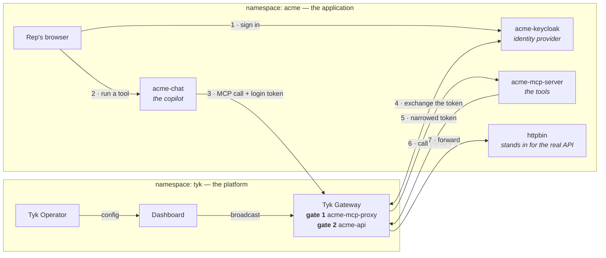
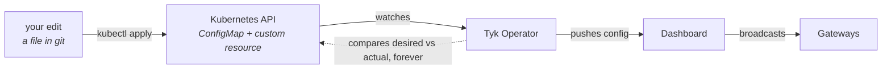
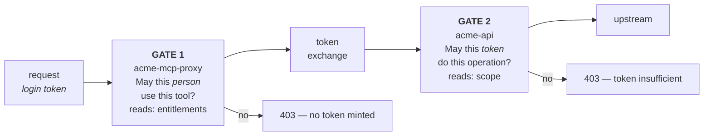
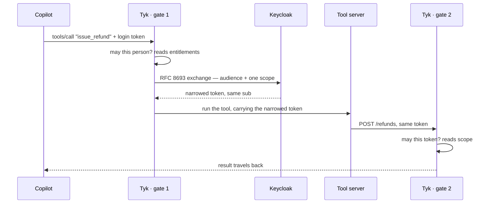

# Acme Support Copilot — an AI agent that can't exceed its user's permissions

A self-contained workshop. You will stand up an AI support copilot that calls real APIs **on behalf of a signed-in person**, and watch the gateway swap that person's broad login token for a narrow one — minted per tool call, scoped to a single action, valid for thirty seconds.

The same refund request will succeed for one user and be refused for another, with no code change between them.

Everything runs locally in one Kubernetes cluster. Total setup is about fifteen minutes, most of it waiting for images.

**Running this for an audience?** [`docs/presenting.md`](docs/presenting.md) is a 30-minute runbook with timings and what to say at each beat.

| If you want | Read |
|---|---|
| To run it | this file, top to bottom |
| The identity model — clients, scopes, mappers, users | [`docs/keycloak.md`](docs/keycloak.md) |
| The gateway config — two gates, the exchange, Operator gotchas | [`docs/tyk-config.md`](docs/tyk-config.md) |
| To change things while it runs | [`live-demo/README.md`](live-demo/README.md) |
| Traces and the two audit trails | [`docs/observability.md`](docs/observability.md) |
| What does not work, honestly | [`docs/limitations.md`](docs/limitations.md) |
| To present it | [`docs/presenting.md`](docs/presenting.md) |

---

## What you will build



The gateway is crossed **twice** on every tool call. That is deliberate, and it is the heart of the design — see [The two gates](#the-two-gates).

| Component | What it is | Its job |
|---|---|---|
| `acme-chat` | Small Go web app | The copilot. Signs the rep in and calls tools for them. |
| `acme-keycloak` | Keycloak 26 | Holds the users, issues tokens, performs the exchange. |
| `acme-mcp-proxy` | Tyk API definition | **Gate 1.** Checks the person may use this tool, then swaps their token. |
| `acme-mcp-server` | Go MCP server | Exposes one tool per operation in an OpenAPI file. Enforces nothing. |
| `acme-api` | Tyk API definition | **Gate 2.** Checks the arriving token is good for this exact operation. |
| `httpbin` | Test server | Stands in for the real API. Echoes requests back, so you can see the token. |
| `jaeger` | Tracing backend | Collects traces from the copilot and the gateway. |
| Tyk Operator | Kubernetes controller | Applies the Tyk configuration from Kubernetes objects. |

---

## Before you start

You need:

- **Docker** running, with about 6 GB available to it
- **kind**, **kubectl** and **helm** on your PATH
- **A Tyk licence with an enterprise scope.** Token exchange is an enterprise feature — on a standard gateway the middleware does nothing and the workshop cannot work.

```bash
cp .env.example .env
# put your licence in .env as TYK_LICENSE=...
```

---

## Step 0 — one hosts entry

```bash
sudo ./scripts/00-hosts.sh
```

<details><summary><b>Why this is needed</b></summary>

Keycloak pins its issuer to `http://acme-keycloak:8280`, so every token it mints carries that issuer no matter which network path reached it. Inside the cluster the name resolves through Kubernetes DNS. Your browser has to reach Keycloak at **the same URL**, or the login redirect goes somewhere that doesn't exist — hence one line in `/etc/hosts` pointing at the port-forward.

This is the first thing most people meet when they move an identity provider into a cluster: **the URL in the token stops being the URL anything dials.** Issuer identity and network reachability are separate concerns.
</details>

---

## Step 1 — cluster and control plane

```bash
./scripts/01-create-cluster.sh
```

Creates a kind cluster, installs cert-manager (the Operator's admission webhook needs it), then Redis, PostgreSQL, and the Tyk stack: Dashboard, Gateway, Pump and Operator. Takes 5–10 minutes on a first run.

Nothing in this step is workshop-specific — it is the platform everything else deploys onto. It is also idempotent, so re-run it if it stops halfway.

<details><summary><b>What it turns on, and why</b></summary>

- **The enterprise gateway image** (`tyk-gateway-ee`) — token exchange lives there.
- **OpenTelemetry export** to `jaeger.acme.svc:4317`, so the gateway's spans join the copilot's traces.
- **Audit logging with detailed recording**, so every configuration change made by the Operator is recorded with its request body.
- **The developer portal is off** — the workshop doesn't use it, and leaving it out saves a pod.

It finishes by restarting the gateway. That isn't superstition: the gateway registers with the Dashboard at boot, and if it wins the race it comes up having loaded no APIs at all.
</details>

---

## Step 2 — deploy the workshop

```bash
./scripts/02-deploy.sh
```

Builds the two Go services, loads them into the cluster, and applies everything with `kubectl apply -k .`.

**Look at what this script does not do:** it never calls the Tyk API. The gateway configuration is applied exactly like the Deployments are — as Kubernetes objects — and the Tyk Operator reconciles them into the Dashboard, which broadcasts to the gateways.



Three objects hold the entire security posture of this agent:

| Object | What it configures |
|---|---|
| `TykMcpProxyDefinition/acme-mcp-proxy` | Gate 1 — the MCP front door, per-tool rules, and the exchange |
| `TykOasApiDefinition/acme-api` | Gate 2 — the resource API and its per-operation scope checks |
| `SecurityPolicy/acme-demo-default` | Grants access to both, so JWT auth has a policy to attach |

```bash
kubectl get tykoasapidefinition,tykmcpproxydefinition,securitypolicy -n acme
```

---

## Step 3 — open the ports

```bash
./scripts/03-port-forward.sh --detach     # survives closing the terminal
```

Each forward is supervised and restarted on its own. `kubectl port-forward` exits for good when it loses its pod — a rollout, an eviction, a laptop sleeping — so an unsupervised forward leaves you with a script that is still running and an endpoint that is silently dead.

```bash
./scripts/03-port-forward.sh --status    # is each endpoint actually up?
./scripts/03-port-forward.sh --stop      # stop a detached run
```

Run it without `--detach` to keep the old foreground behaviour, where ctrl-c stops everything.

| | |
|---|---|
| Copilot | <http://localhost:8095> |
| Keycloak admin | <http://acme-keycloak:8280> — `admin` / `admin` |
| Tyk Dashboard | <http://localhost:3000> — `admin@acme.example` / `Workshop-2026!` |
| Traces | <http://localhost:16686> |

> With `--detach` these survive both the terminal closing and a pod restarting. If the copilot suddenly stops responding mid-workshop, run `--status` before assuming anything else is wrong.

---

## Step 4 — prove it works

```bash
./scripts/04-test.sh
```

Expect `10 passed, 0 failed`. It signs in as a real user, runs a real tool call through the gateway, decodes the token that actually arrived, and asserts the claims changed the way they should.

Run this before presenting. It is the fastest way to know the whole chain is healthy.

---

## Now walk through it

Open <http://localhost:8095> and sign in. Three users, all with password `Acme-Demo-2026!`:

| User | Entitlements | Look up | Update | Refund |
|---|---|---|---|---|
| **alice** | `customers:read` | ✅ | ❌ | ❌ |
| **carol** | `customers:read customers:write` | ✅ | ✅ | ❌ |
| **bob** | `customers:read customers:write refunds:write` | ✅ | ✅ | ✅ |

### 1. As alice, look up a customer

It works. Now read the **Delegation inspector** on the right, slowly — this is the moment the workshop exists for.

| | alice's login token | what the API received |
|---|---|---|
| `sub` | alice | **alice — unchanged** |
| `aud` | tyk-mcp-gateway | **api.acme.internal** |
| `scope` | openid customers:all | **customers:read** |
| `azp` | acme-support-chat | **tyk-mcp-gateway** |

- **`sub` unchanged** — her identity survived the hop, so your audit trail still names a human.
- **`aud` re-pointed** — this token is only accepted by one API.
- **`scope` narrowed** — from an umbrella to the single action she asked for.
- **`azp` now the gateway** — the record of *which system* acted on her behalf.

Both raw JWTs are in the inspector, click-to-select. Paste one into jwt.io if anyone doubts it.

### 2. As alice, issue a refund

`403`. And notice what the inspector *doesn't* show: there is no token pair, **because no token was ever minted**. `refunds:write` isn't in alice's entitlements, so gate 1 refused before contacting Keycloak. The refund API never saw a request.

That is a preventive control, not a detective one.

### 3. As bob, issue a refund

It succeeds, and the exchanged token now carries `refunds:write` — a different capability, minted for that one call.

**Nothing in Tyk, the MCP server or the copilot changed between those two refunds.** The only difference is one attribute on one user in the identity provider.

---

## The two gates

The gateway checks twice, against two *different* claims. This is the part people miss.



| Gate | Question | Claim it reads |
|---|---|---|
| `acme-mcp-proxy` | May this **person** use this tool? | `entitlements` — per person, stamped by the IdP |
| `acme-api` | May this **token** do this operation? | `scope` — per call, narrowed by the exchange |

**The question you will be asked:** *"Her token says `customers:all`. Why does a tool needing `customers:read` let her through?"*

Because gate 1 never looks at `scope`. `customers:all` is the umbrella the **application** requested at login — it describes what the app asked for, not what the person is permitted. Gate 1 reads `entitlements`, which comes from her user record and which the app cannot inflate. Keycloak then grants the narrow scope during the exchange not because it was in her token, but because the gateway's own client is allowed to request it.

---

## The flow, in order



The copilot never holds the narrowed token. It is minted inside the gateway, used for one hop, and cached there for at most 30 seconds.

---

## Change it live

The reason this runs on Kubernetes. Each of these is an edit to a file, then `kubectl apply -k .`. Three of six are below; all six, with copy-paste JSON, are in [`live-demo/README.md`](live-demo/README.md) — including **adding a user with a new permission tier**, which is the one that best shows where agent authorization belongs.

### Tighten a tool — no restart, ~20 seconds

In `data/acme-mcp-proxy.oas.json`, under `middleware.mcpTools`:

```json
"recent_orders": { "security": [{ "oauth2": ["customers:write"] }], ... }
```

```bash
kubectl apply -k .
```

Alice's **Recent orders** — which worked a minute ago — now returns `403`. Revert and it works again.

No pod restarted. Nobody logged into the Dashboard. And the change went through code review, because it was a file.

### Turn the exchange off — the sceptic's beat

```json
"tokenExchange": { "enabled": false, ... }
```

Apply, then run **Look up customer** as alice. Tyk forwards her raw login token to the resource API, which refuses it:

```json
{ "error": "insufficient_scope",
  "error_description": "token does not satisfy required scopes: customers:read" }
```

Her login token says `customers:all` — an umbrella the resource API has never heard of. Without the exchange, **no token in the system satisfies `customers:read`**. That one line of config is the whole mechanism.

### Add a tool from an OpenAPI file

The tools are generated, not written. Add an operation to `data/acme-api.oas.json`, add a matching rule to `data/acme-mcp-proxy.oas.json`, then:

```bash
kubectl apply -k . && kubectl rollout restart deploy/acme-mcp-server -n acme
```

The copilot discovers tools over MCP, so the new one appears as a button — already governed by both gates. See [`live-demo/README.md`](live-demo/README.md) for the exact JSON.

---

## Who did what

Two different audit questions, two different sources.

```bash
./live-demo/activity.sh carol      # what this person's copilot did, refusals included
./live-demo/whoami.sh              # what each user's token actually claims
```

```
when      user      tool              outcome
16:19:25  carol     issue_refund      DENIED (insufficient scope)
16:17:28  carol     update_customer   allowed
16:17:28  carol     lookup_customer   allowed
```

> **Why this reads traces and not analytics.** MCP proxy APIs emit no Tyk analytics records on 5.14 or 5.15, so the traffic log only sees calls that reached the *resource* API — it is blind to every refusal at gate 1, which is the event you most want audited. The gateway's spans carry both the user and the tool name for allowed *and* denied calls, so the trace data is the complete record.

For configuration changes, the Dashboard's **Audit Logs** view records everything the Operator does. Filter the URL by `/api/mcps` to cut the noise. The actor is the Operator's Dashboard user, so: **Tyk's audit log says what changed and when; git says who asked and why.**

---

## Repository layout

```
├── data/                    the three documents that define everything
│   ├── realm-acme.json        users, clients, scopes, protocol mappers
│   ├── acme-api.oas.json      gate 2 + the source of the MCP tools
│   └── acme-mcp-proxy.oas.json  gate 1 + the exchange
├── k8s/                     Kubernetes manifests and the three Tyk resources
├── services/                the copilot and the MCP tool server (Go)
├── scripts/                 numbered, run in order
├── live-demo/               the six change-live exercises and audit helpers
├── docs/                    identity model, gateway config, observability,
│                              limitations, and the presenter runbook
├── platform/                redis + postgres for the control plane
└── kustomization.yaml       kubectl apply -k .
```

---

## Troubleshooting

| Symptom | Cause | Fix |
|---|---|---|
| Copilot or Dashboard unreachable | a forward died, or was never started | `./scripts/03-port-forward.sh --status`, then `--detach` |
| `403 Access disallowed` on everything | the policy didn't reconcile | check `.status.pol_id` on the SecurityPolicy; `02-deploy.sh` nudges it for you |
| Every route 404s | the gateway registered before the Dashboard was up | `kubectl rollout restart deploy/gateway-tyk-tyk-gateway -n tyk` |
| `ImagePullBackOff` on chat or mcp-server | images not on the node | re-run `./scripts/02-deploy.sh` |
| Login redirects somewhere unreachable | no hosts entry, or 8280 not forwarded | `sudo ./scripts/00-hosts.sh`, then re-run the port-forwards |
| A new user behaves like an existing one | `entitlements` written as multiple array elements | it must be **one space-separated string**. `./live-demo/whoami.sh` detects this |
| `403` everywhere after restarting Keycloak | realm signing key rotated, gateway holds a stale JWKS | shouldn't happen — the key is pinned in the realm. If it does, restart the gateway |
| API CR shows `latestTransaction.status: Failed` | the Dashboard rejected the document | read `.status.latestTransaction.error` — it names the field |

---

## What this does not do

Worth saying out loud, because someone will ask. The full list, with the operational sharp edges, is in [`docs/limitations.md`](docs/limitations.md).

- **The tool list is not filtered per user.** `tools/list` returns all five tools to alice, including `issue_refund`, which she cannot call. Enforcement happens when a tool is *invoked*, not when it is discovered — the catalogue is a description of the API surface, not an authorization decision. Filtering it would be a usability improvement, not a security one: hiding a tool the gateway already refuses adds obscurity, not a control. Worth saying before someone asks.
- **This is impersonation, not delegation.** The exchanged token keeps the rep's `sub` and records the gateway only as `azp`. RFC 8693 also describes a formal actor chain via an `act` claim — Keycloak's standard token exchange does not mint one, and neither do Okta or Auth0. Ping and Curity do. If a compliance model needs a cryptographic delegation chain, that is a choice of identity provider, not of gateway.
- **The identity provider is on the critical path.** If Keycloak is down, tool calls fail. That is the honest trade for having no long-lived credentials anywhere.
- **Exchange-specific telemetry is thin.** The exchange middleware produces a timed span, but no provider, outcome or cache-hit attributes yet.

---

## Tear it down

```bash
./scripts/99-teardown.sh             # remove the workshop, keep the cluster
./scripts/99-teardown.sh --cluster   # delete everything
```
