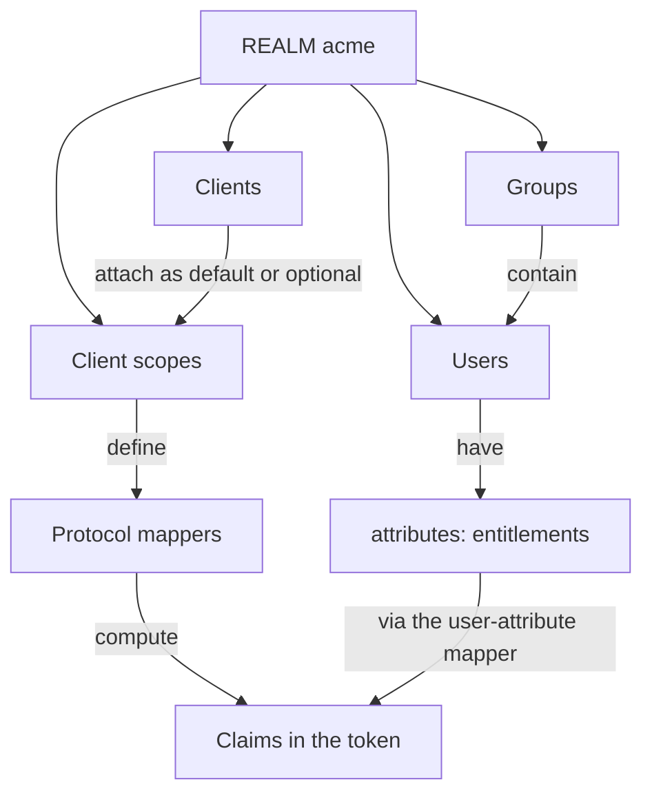
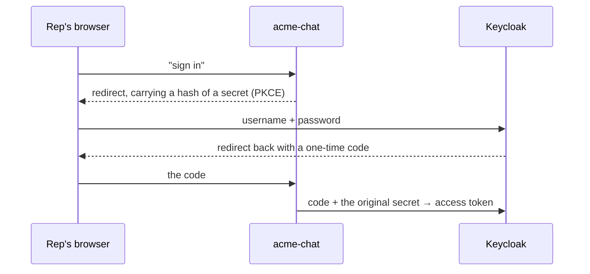

# Keycloak — the identity model

Everything in this document is created by `data/realm-acme.json`, imported when the Keycloak pod starts. Nothing was clicked. But you should walk the admin console as though it had been, because that is how your audience will have to build it.

**Admin console:** <http://acme-keycloak:8280> — `admin` / `admin`, realm **acme**.

```bash
kubectl get configmap acme-keycloak-realm -n acme   # the whole identity model, one file
```

---

## The vocabulary, in dependency order

Keycloak's own names get in the way, so define them before opening the console.

| Term | What it actually is | Here |
|---|---|---|
| **Realm** | An isolated tenant. Its URL is the token's `iss`. | `acme` |
| **Client** | An *application* that requests or receives tokens. Not a customer. | three of them |
| **Client scope** | A reusable bundle of a scope name plus protocol mappers. **Default** scopes always apply; **optional** ones apply when asked for. | `customers:read`, `entitlements`, … |
| **Protocol mapper** | A rule on a client scope that *computes a claim* — copy a user attribute, stamp an audience, emit `sub`. | 6 of them |
| **Audience** | Who a token is *for* (`aud`). In Keycloak an audience **is a client**. | `api.acme.internal` |
| **User attribute** | A custom field on a user record. A mapper turns it into a claim. | `entitlements` |
| **Group** | A collection of users. Org modelling only — nothing here enforces on it. | `acme-support`, `acme-supervisors` |

How they connect:



**The chain this workshop turns on:** a *user* carries an *attribute*; the chat *client* logs them in and its *scopes* stamp `entitlements` and `aud=tyk-mcp-gateway` into the token; the *exchange*, performed by the `tyk-mcp-gateway` client, re-points the token at another client (`api.acme.internal`) with the one scope the tool needs.

---

## Stop 1 · Clients — three, and only one is an app

**Clients** in the left nav.

| Client | Type | Why it exists |
|---|---|---|
| `acme-support-chat` | Public, auth-code + PKCE | The copilot. Where alice, carol and bob actually log in. Redirect URI `http://localhost:8095/callback`. |
| `tyk-mcp-gateway` | Confidential, secret `acme-demo-exchange-secret` | The identity **Tyk** authenticates as when it performs the exchange. |
| `api.acme.internal` | Audience-only | Never logs anyone in. It exists purely to **be** an audience. |

Open `tyk-mcp-gateway` → **Client details** and point at **Standard token exchange: enabled**. That single toggle is what permits the whole mechanism. It is per-client, and it arrived in Keycloak 26.2.

> **The third client trips up everyone.** Keycloak has no free-floating "resource" or "API" object. If you want a token addressed to your API, the API has to exist as a client. `api.acme.internal` is a client with no flows enabled and a secret nobody uses.

---

## Stop 2 · Client scopes — the permission vocabulary, and two audience tricks

**Client scopes** in the left nav. Six of them, doing three different jobs.

| Scope | Mapper | Effect |
|---|---|---|
| `customers:read` `customers:write` `customers:all` `refunds:write` | — | The permission vocabulary. Land in the token's `scope` claim when granted. |
| `entitlements` | user attribute → claim | Copies the user's `entitlements` attribute into a claim. **This is what gate 1 reads.** |
| `acme-identity` | `sub`, `preferred_username`, name | Identity claims, on both the login token and the exchanged one. |
| `mcp-gateway-audience` | audience → `tyk-mcp-gateway` | Makes the login token **exchangeable** by the gateway. |
| `acme-api-audience` | audience → `api.acme.internal` | Makes the downstream audience **reachable** by the exchange. |

Those last two are not decoration. They are there because of two hard constraints:

> **Keycloak's standard token exchange only accepts a subject token whose `aud` already includes the exchanging client** — hence `mcp-gateway-audience` on the chat client.
>
> **And it only mints an `audience` that the exchanging client's own scopes can produce** — hence `acme-api-audience` on `tyk-mcp-gateway`.
>
> It also **ignores the RFC 8707 `resource` parameter** entirely. Tyk sends it anyway; Keycloak drops it.
>
> Miss either mapper and you get `Client is not within the token audience`, which does not tell you which one.

### Why the scope names differ from the entitlement names

They look the same and they are not the same thing.

- `scope` is what a **token** may do. It is what the exchange narrows, and what gate 2 enforces.
- `entitlements` is what a **person** may do. It is what gate 1 enforces, and the application cannot influence it.

The chat asks for `customers:all` at login — an umbrella. That is a *request by an application*, not a grant to a person. This distinction is the single most common question in the room; see [tyk-config.md](tyk-config.md#the-two-gates) for the enforcement side.

---

## Stop 3 · Users — where authorization actually lives

**Users** → alice → **Attributes**. One custom attribute:

```
alice.entitlements = "customers:read"
carol.entitlements = "customers:read customers:write"
bob.entitlements   = "customers:read customers:write refunds:write"
```

One space-separated string, not a list. See the warning in [the exercises](../live-demo/README.md#2--add-a-user-with-a-new-permission-tier) — the mapper is single-valued and silently keeps only the first array element.

Groups (`acme-support`, `acme-supervisors`) model the org boundary. **Nothing in this workshop enforces on groups** — the `entitlements` claim is what gets checked. In a real deployment this attribute would be federated from your HR or IAM source, and that is the point: the thing that decides what an agent may do is an ordinary identity-management artifact.

Check what the tokens actually say:

```bash
./live-demo/whoami.sh
```

---

## Stop 4 · Two settings that will bite you

### The issuer is pinned

`k8s/keycloak.yaml` sets `KC_HOSTNAME: http://acme-keycloak:8280`. Every token carries that issuer no matter which network path reached Keycloak. The three addresses in play:

| Who | Address | Why |
|---|---|---|
| Token `iss`, and the exchange provider's `issuers` | `http://acme-keycloak:8280` | Identity. Fixed by `KC_HOSTNAME`. |
| Gateway → JWKS and token endpoint | `acme-keycloak.acme.svc:8280` | The gateway runs in the `tyk` namespace, so it needs the FQDN. |
| Browser → login page | `acme-keycloak:8280` | hosts entry + port-forward. |

**Issuer identity and network reachability are different concerns.** The moment an IdP moves into a cluster, the URL in the token stops being the URL anything dials — and conflating them produces validation failures that look like key problems.

### The signing key is pinned

The realm declares a static RSA `KeyProvider` called `acme-static-rsa`. This is not cosmetic.

Keycloak here has no persistent volume, so restarting the pod gives it a fresh database — which is exactly what makes the realm re-import, and therefore what makes "add a user by editing a file" work. Without a pinned key, that same restart mints **new realm signing keys**, the gateway is still holding the old JWKS, and every request fails with `no matching KID found in any JWKs` and a `403` — for every user, not just the new one.

With the key pinned the `kid` survives restarts and nothing downstream notices. Do not remove it.

---

## Signing in — what actually happens

Ordinary OpenID Connect. Worth three minutes because two details matter later.



**PKCE** ("pixie", Proof Key for Code Exchange): the app invents a secret, sends a hash of it when starting login, and reveals the original when redeeming the code. Anyone who intercepts the code cannot use it. The password only ever reaches Keycloak.

The two details to carry forward:

1. **The token that comes back is deliberately broad** — `scope: openid customers:all`.
2. **It carries an `entitlements` claim** — and that, not `scope`, is what the gateway will trust.

Also note `LOGIN_PROMPT=login` on the chat Deployment. It forces the Keycloak login screen every time so you can switch between users live. Without it, Keycloak silently reuses the existing session and you will appear to log in as the previous user — a classic mid-demo confusion.

---

## Access tokens live 300 seconds

Set by `accessTokenLifespan` in the realm. Deliberately short, and it has a practical consequence: **if you have been talking for a while, re-run a read before attempting a refund**, or someone will read an expiry error as a bug in the exchange.

The copilot now detects this and offers a sign-in link rather than failing opaquely, but a fresh login is still the fastest fix.
