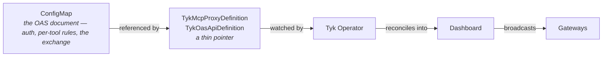
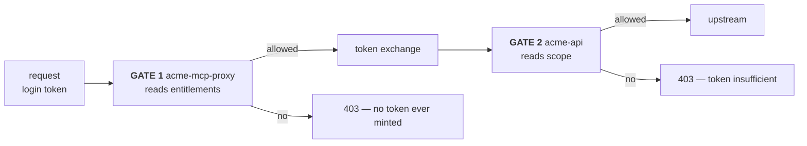
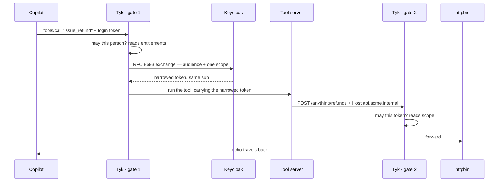

# Tyk configuration — the two gates, the exchange, and the Operator

Three Kubernetes objects hold the entire security posture of this agent. This document explains what is inside them, and the four things that will surprise you.

```bash
kubectl get tykoasapidefinition,tykmcpproxydefinition,securitypolicy -n acme
```

---

## The shape of it



The custom resource is almost empty — it names a ConfigMap and nothing else. **The document is the source of truth**; the CR exists to give the Operator something to watch.

In the compose version of this demo, a bootstrap script created the APIs, created a policy, read back the generated ids and patched them into the APIs. All of that is gone. The CR says what should exist; the Operator makes it so, and keeps making it so.

---

## The two gates

The gateway checks twice, against two **different claims**. This is the part people miss, and the question you will be asked.

| Gate | Resource | Question | Claim it reads |
|---|---|---|---|
| **1** | `acme-mcp-proxy` | May this **person** use this tool? | `entitlements` |
| **2** | `acme-api` | May this **token** do this operation? | `scope` |



> **“Her token says `customers:all`. Why does a tool needing `customers:read` let her through?”**
>
> Because gate 1 never looks at `scope`. `customers:all` is the umbrella the *application* requested at login — it describes what the app asked for, not what the person is permitted. Gate 1 reads `entitlements`, which comes from her user record and which the app cannot inflate. Keycloak then grants the narrow scope during the exchange not because it was in her token, but because the gateway's own client is permitted to request it.

The payoff is alice's refund: gate 1 sees `refunds:write` missing from her entitlements and returns **403 before contacting Keycloak at all**. No token is minted, no request reaches the refund API. A preventive control, and nothing downstream has to be trusted to enforce it.

---

## Inside gate 1 — `data/acme-mcp-proxy.oas.json`

Four blocks matter.

### Who is calling — JWT against Keycloak's JWKS

```json
"keycloakJwt": {
  "jwksURIs": [{ "url": "http://acme-keycloak.acme.svc:8280/realms/acme/protocol/openid-connect/certs" }],
  "signingMethod": "rsa",
  "identityBaseField": "preferred_username",
  "defaultPolicies": ["acme-demo-default"]
}
```

`identityBaseField` decides what the analytics and spans call the user. Set to `preferred_username` it reads `carol`; set to `sub` it reads a UUID and your audit trail needs a lookup to be legible. The trade-off is that usernames are not stable across a rename — choose deliberately.

### May this person do this — the entitlement check

```json
"oauth2": {
  "scopeCheck": { "enabled": true, "claimNames": ["entitlements"], "separator": " " },
  "protectedResourceMetadata": { "enabled": true,
    "authorizationServers": ["http://acme-keycloak:8280/realms/acme"] }
}
```

Read the claim name carefully — `entitlements`, not `scope`.

### The exchange

```json
"tokenExchange": {
  "enabled": true,
  "providers": [{
    "name": "keycloak",
    "issuers": ["http://acme-keycloak:8280/realms/acme"],
    "tokenEndpoint": "http://acme-keycloak.acme.svc:8280/realms/acme/protocol/openid-connect/token",
    "clientAuth": { "method": "client_secret_basic", "clientId": "tyk-mcp-gateway",
                    "clientSecret": "acme-demo-exchange-secret" },
    "defaultTarget": { "audience": "api.acme.internal", "scopes": ["customers:read"] },
    "cache": { "enabled": true, "mode": "derived", "maxTimeout": "30s", "safetyMargin": "5s" }
  }]
}
```

Note `issuers` uses the **pinned** hostname (it must match the token's `iss`) while `tokenEndpoint` uses cluster DNS (it must be dialable from the `tyk` namespace). Those are different jobs — see [keycloak.md](keycloak.md#the-issuer-is-pinned).

**Derived caching** takes the TTL from the exchanged token's own lifetime, capped at 30s and retired 5s early. A burst of tool calls costs one round trip to the IdP, and no token is ever served that expires in flight.

### Per-tool rules

```json
"mcpTools": {
  "lookup_customer": { "security": [{ "oauth2": ["customers:read"] }],
                       "scopeCheck": { "enabled": true }, "exchange": { "enabled": true } },
  "issue_refund":    { "security": [{ "oauth2": ["refunds:write"] }], ... }
}
```

There is no `exchange.scopes` here on purpose. **The outbound scope is inferred from each tool's own `security` requirement**, so one declaration drives both the entitlement check and the minted token. You can pin `exchange.scopes` explicitly if you prefer; the provider's `defaultTarget.scopes` is the last fallback.

---

## Inside gate 2 — `data/acme-api.oas.json`

Short, and the one that makes the design defensible: **the resource API never exchanges anything**.

```json
"customDomain": { "enabled": true, "name": "api.acme.internal" },
"upstream":     { "url": "http://httpbin.acme.svc" },
"oauth2": { "scopeCheck": { "enabled": true, "claimNames": ["scope"] } },
"operations": {
  "lookupCustomer": { "scopeCheck": { "enabled": true } },
  "issueRefund":    { "scopeCheck": { "enabled": true } }
}
```

Required scopes per operation live in the OpenAPI document itself — each operation's `security` block — so **the API contract is the authorization policy**. The MCP server reaches it by sending `Host: api.acme.internal`, which is why the gateway needs `enable_custom_domains` (the install script turns it on).

---

## Four things that will surprise you

### 1 · How the policy gets bound

JWT auth returns `403 Access disallowed` unless the JWT scheme names a default policy — and a policy can only be created once the APIs it grants access to exist. The two API kinds differ:

- `TykOasApiDefinition` has a `spec.jwtAuth.defaultPoliciesRef` field the Operator resolves into the policy's `_id`.
- `TykMcpProxyDefinition` has **no equivalent** — its spec is only a ConfigMap reference.

So both APIs bind the same way instead: the `SecurityPolicy` carries an explicit `id` (`acme-demo-default`), and both documents name that id in `defaultPolicies`. This works because the gateway runs with `allow_explicit_policy_id`, which makes the policy's `id` — rather than the Dashboard-generated `_id` — the lookup key. One mechanism for both, and the documents stay the source of truth.

### 2 · The Operator's CR-level override fields are not used

`spec.customDomain` and `spec.jwtAuth` on `TykOasApiDefinition` are deliberately absent. On Operator v1.4.2 against Dashboard v5.14/5.15 both re-serialise the OAS document in a way the Dashboard rejects:

- `spec.jwtAuth.defaultPoliciesRef` → `Missing required Security Scheme 'keycloakJwt' in Components.SecuritySchemes` — the schemes *are* present; the document the Operator sends loses them.
- `spec.customDomain` → `x-tyk-api-gateway.server.customDomain.certificates: Invalid type. Expected: array, given: null`.

Both settings are declared inside the OAS document instead, where they already belong, and reconcile cleanly. If you hit a similar validation error after adding a CR-level override, check this first.

### 3 · The API id is deterministic

```bash
kubectl get tykoasapidefinition acme-api -n acme -o jsonpath='{.status.id}'
# YWNtZS9hY21lLWFwaQ   ==  base64("acme/acme-api")
```

Derived from namespace and name, so it is stable across rebuilds. Tear the whole thing down, apply it again, and the API returns with the same id.

### 4 · The SecurityPolicy can lose a race

It references both APIs, so its first reconcile can run before they exist on Tyk and fail with `Failed to find ApiDefinition on Tyk`. controller-runtime retries with backoff; `02-deploy.sh` nudges the object to make the retry immediate. If you ever see the policy stuck with an empty `status.pol_id`:

```bash
kubectl annotate securitypolicy acme-demo-default -n acme tyk.tyk.io/nudge="$(date +%s)" --overwrite
```

Note that an annotation nudge works for `SecurityPolicy` but **not** for `TykMcpProxyDefinition`, which ignores metadata-only changes.

---

## The request, end to end



What Tyk POSTs to Keycloak for one tool call:

```
POST /realms/acme/protocol/openid-connect/token     Authorization: Basic <tyk-mcp-gateway>

grant_type         = urn:ietf:params:oauth:grant-type:token-exchange
subject_token      = <the rep's login JWT>
subject_token_type = urn:ietf:params:oauth:token-type:access_token
audience           = api.acme.internal
resource           = api.acme.internal        // RFC 8707 companion; Keycloak ignores it
scope              = refunds:write            // just this one tool
```

The copilot never holds the narrowed token. It is minted inside the gateway, used for one hop, and cached there for at most 30 seconds.
