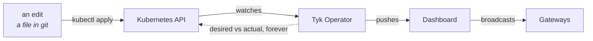

# Follow along — the 30-minute walkthrough

This is what I'm demonstrating, in the order I'm demonstrating it, with every command I run.

Follow along live if you have the cluster up, or work through it later at your own pace. Everything here is reproducible on a laptop; nothing depends on me being in the room.

If you're starting from scratch, do [the setup](../README.md#before-you-start) first. It's about fifteen minutes, most of it waiting for images.

**Slides:** <https://claude.ai/code/artifact/cb1d4aa9-a54e-44ef-b1d2-b83bb4091c8b> — the same walkthrough as a deck. Hit *Read mode* to scroll it like a document instead.

| | | |
|---|---|---|
| 1 | [Two questions, not one](#1--two-questions-not-one) | why agent permissions are a problem you already have |
| 2 | [Identity comes from a file](#2--identity-comes-from-a-file) | who the users are, and what they're allowed |
| 3 | [Config is a Kubernetes object](#3--config-is-a-kubernetes-object) | where the security posture lives |
| 4 | [Watch it work](#4--watch-it-work) | three requests, two outcomes |
| 5 | [Change it live](#5--change-it-live) | edit a file, watch the running system change |
| 6 | [Who did what](#6--who-did-what) | the audit trail |

---

## 1 · Two questions, not one

A support rep asks an AI copilot to look up a customer, and the copilot calls an API. Everyone asks the obvious question: whose permissions does that call run with?

Almost nobody asks the second one. **Who gets to change the answer, and how would you audit it six months from now?**

Here's the whole security posture of the agent you're about to watch:

```bash
kubectl get pods -n acme
kubectl get tykoasapidefinition,tykmcpproxydefinition,securitypolicy -n acme
```

Three resources. They're in git, they go through review, and a controller is continuously making the gateway match them.

Three things I'll show you:

- The same request succeeds for one person and is refused for another, with no code change between them
- The before and after token, so you don't have to take it on faith
- A change to what a tool is allowed to do, made live, from a text file

---

## 2 · Identity comes from a file

<http://acme-keycloak:8280>, realm **acme**, `admin` / `admin`.

None of this was clicked. The realm is a ConfigMap that Keycloak imports at startup, so the users, the clients and the mappers are all in version control.

**Three clients, and only one is an app.**

| Client | What it is |
|---|---|
| `acme-support-chat` | the copilot — the only thing a human logs into |
| `tyk-mcp-gateway` | the gateway's own client, with **standard token exchange enabled** |
| `api.acme.internal` | a client that never logs anyone in |

That last one is worth a second. It exists purely to *be* an audience, because Keycloak has no separate concept of a resource. It's a client in the way a parking space is a building.

**Users → alice → Attributes.** One custom attribute:

```
entitlements = "customers:read"
```

Bob has `customers:read customers:write refunds:write`. That attribute is what gets enforced, not the group memberships.

**Why the issuer is a hostname you can't reach normally.** `KC_HOSTNAME` pins the issuer to `http://acme-keycloak:8280`, so every token carries that issuer whatever network path reached it. Inside the cluster it resolves through Kubernetes DNS; on your laptop it needs a hosts entry.

The URL in the token stops being the URL anything dials. Issuer identity and network reachability are separate concerns, and this is where most teams find that out.

---

## 3 · Config is a Kubernetes object

In the Docker Compose version of this demo, a bootstrap script creates the APIs, creates a policy, reads back the generated ids and patches them into the APIs. All of that is gone.

The custom resource says what should exist. The Operator makes it so, and keeps making it so.



Two documents carry the whole design, and they ask different questions.

| | `data/acme-mcp-proxy.oas.json` | `data/acme-api.oas.json` |
|---|---|---|
| Called | **gate 1** | **gate 2** |
| Question | may this **person** use this tool? | may this **token** do this operation? |
| Reads | `entitlements` | `scope` |

Four things to look at in the proxy document:

- the **JWKS block**, where the gateway fetches Keycloak's public keys
- `claimNames: ["entitlements"]`, which is gate 1 choosing what to believe
- the **`tokenExchange` provider**, with its audience and its 30-second cache
- the **`mcpTools` map**, one entry per tool, each naming the scope it needs

### The question everyone asks

> *Alice's token says `customers:all`. Why does a tool needing `customers:read` let her through?*

Because gate 1 never looks at `scope`.

`customers:all` is the umbrella the **application** requested at login. It describes what the app asked for, which has nothing to do with what alice is permitted. It's in her token because one environment variable on the copilot says so.

Gate 1 reads `entitlements`, which comes from her user record and which the app has no way to inflate.

You can see both claims on the same token:

```bash
./live-demo/whoami.sh
```

---

## 4 · Watch it work

<http://localhost:8095>, with the **Delegation inspector** open on the right.

### Alice looks up a customer

Sign in as **alice**, customer `C-1024`, **Look up customer**. It works.

Now read the inspector. Two tokens, four claims that changed:

| | alice's login token | what the API received |
|---|---|---|
| `sub` | alice | **alice — unchanged** |
| `aud` | tyk-mcp-gateway | **api.acme.internal** |
| `scope` | openid customers:all | **customers:read** |
| `azp` | acme-support-chat | **tyk-mcp-gateway** |

Same `sub`, so her identity survived the hop and your audit trail still names a human. New `aud`, so exactly one API will accept this token. Narrowed `scope`, down to the one action she asked for. And `azp` now names the gateway: the record of which system acted on her behalf.

Both raw JWTs are click-to-select in the inspector. Paste one into [jwt.io](https://jwt.io) and read it yourself.

### Alice issues a refund

`403`.

Look at what the inspector *doesn't* show: there's no token pair, **because no token was ever minted**. `refunds:write` isn't in alice's entitlements, so the gateway refused at the front door. Keycloak was never contacted. The refund API never received a request.

That's a preventive control. Most access control you meet in production is detective — it lets the call through and records that it happened.

### Bob issues the same refund

Sign out, sign in as **bob**, **Issue refund**. It succeeds, and the exchanged token carries `refunds:write`.

**Nothing in Tyk, the MCP server or the copilot changed between those two refunds.** One attribute, on one user, in the identity provider.

---

## 5 · Change it live

This is why it runs on Kubernetes. Each of these is an edit to a file, then one command.

Your escape hatch at any point:

```bash
git checkout data/ && kubectl apply -k .
```

### Tighten a tool

In `data/acme-mcp-proxy.oas.json`, under `middleware.mcpTools`, make `recent_orders` require a scope alice doesn't have:

```json
"recent_orders": { "security": [{ "oauth2": ["customers:write"] }], ... }
```

```bash
kubectl apply -k .
```

Alice's **Recent orders**, which worked a minute ago, now returns `403`. It takes a few seconds.

No pod restarted. Nobody logged into a dashboard. And because the change was a file, it went through code review — there's a commit, an author, a reviewer and a diff, for a change to an agent's permissions.

Revert and it comes back.

### Add a person with a new permission tier

Paste `dave` into the `users` array in `data/realm-acme.json`, copying alice's `credentials` block so his password is the same:

```json
{
  "username": "dave",
  "enabled": true,
  "email": "dave@acme.example",
  "emailVerified": true,
  "firstName": "Dave",
  "lastName": "Acme",
  "credentials": [ <<< copy alice's credentials block >>> ],
  "groups": ["/acme-support"],
  "attributes": { "entitlements": ["customers:read refunds:write"] }
}
```

> `entitlements` is an array holding **one space-separated string**. Written as `["customers:read", "refunds:write"]` it silently breaks: the mapper is single-valued, so Keycloak keeps the first element and drops the rest, and dave behaves exactly like alice. `./live-demo/whoami.sh` catches it before you restart anything.

```bash
kubectl apply -k .
kubectl rollout restart deploy/acme-keycloak -n acme
until curl -sf http://acme-keycloak:8280/realms/acme/.well-known/openid-configuration >/dev/null; do sleep 3; done
```

Dave can issue refunds and cannot edit customer records — a tier nobody had ten seconds ago.

| user | lookup | update | refund |
|---|---|---|---|
| alice | 200 | 403 | 403 |
| carol | 200 | 200 | 403 |
| **dave** | **200** | **403** | **200** |
| bob | 200 | 200 | 200 |

Nothing in Tyk changed. No tool redefined, no policy edited, no gateway reloaded. A whole tier of agent access is one attribute on one user in the identity provider, which is exactly where it belongs and exactly who should own it.

### Turn the exchange off

The one for the sceptic. In the same file:

```json
"tokenExchange": { "enabled": false, ... }
```

Apply, then look up a customer as alice:

```json
{ "error": "insufficient_scope",
  "error_description": "token does not satisfy required scopes: customers:read" }
```

Her login token says `customers:all` — an umbrella the resource API has never heard of and has no reason to treat as covering anything. With the exchange off, **no token anywhere in this system satisfies `customers:read`**.

That one boolean is the entire mechanism.

---

## 6 · Who did what

Two audit questions, two different sources. Don't conflate them.

**What did this person's agent do?**

```bash
./live-demo/activity.sh carol 10
```

```
when      user      tool              outcome
16:19:25  carol     issue_refund      DENIED (insufficient scope)
16:17:28  carol     update_customer   allowed
16:17:28  carol     lookup_customer   allowed
```

Allowed calls and refused ones, named by person and by tool.

This reads **traces rather than analytics**, and the reason is a real limitation: MCP proxy APIs emit no Tyk analytics records on 5.14 or 5.15. The traffic log only sees calls that reached the resource API, so it's blind to every refusal at gate 1 — which is the event you most want audited. The gateway's spans carry the caller and the tool name for allowed and denied calls alike.

**What changed, and when?** Tyk Dashboard → **Audit Logs**, filtered by `/api/mcps`. Every edit above is there with the document the Operator sent. The actor is the Operator's Dashboard user rather than a person, which leaves a useful division:

**Tyk's audit log says what changed and when. Git says who asked and why.**

Open one trace at <http://localhost:16686>, service `acme-support-chat`, and you'll see both gateway hops in a single trace:

```
acme-support-chat  mcp lookup_customer              the agent's own span
  tyk              POST /json-rpc-method:tools/call MCP as a protocol, not an opaque POST
  tyk              POST /mcp-tool:lookup_customer   a span per tool
  tyk              MCPAccessControlMiddleware       gate 1
  tyk              OAuth2TokenExchangeMiddleware    the exchange, timed
  tyk              GET /anything/customers/C-1024   gate 2
```

One caveat, stated precisely: that exchange span is timed but carries no provider, outcome or cache-hit attributes. Still true on 5.15.

---

## What to take away

The agent gained no privileges of its own. The rep's identity reached the API intact, so the audit trail still names a person. Every token on the wire was good for one action, one audience, thirty seconds.

And none of it is application code. It's three Kubernetes resources under review.

Change what the agent may reach and you've opened a pull request.

## Things this does not do

Worth knowing before you build on it. The full list is in [limitations.md](limitations.md).

- **It does not stop prompt injection.** Nothing here prevents an agent being tricked into calling a tool. It ensures that when it does, the call carries only the permissions of the person it's acting for. Containment, rather than prevention.
- **This is impersonation, not delegation.** The exchanged token keeps the rep's `sub` and records the gateway as `azp`. RFC 8693's formal `act` chain isn't minted by Keycloak, Okta or Auth0. Ping and Curity do.
- **The identity provider is on the critical path.** Keycloak goes down, tool calls fail. That's the trade for having no long-lived credentials anywhere.

## Keep going

Want to build this yourself rather than watch it? [agent-authorization-lab](https://github.com/hellobudha/agent-authorization-lab) is the two-hour hands-on version: six labs, starting from an agent with no protection at all.
